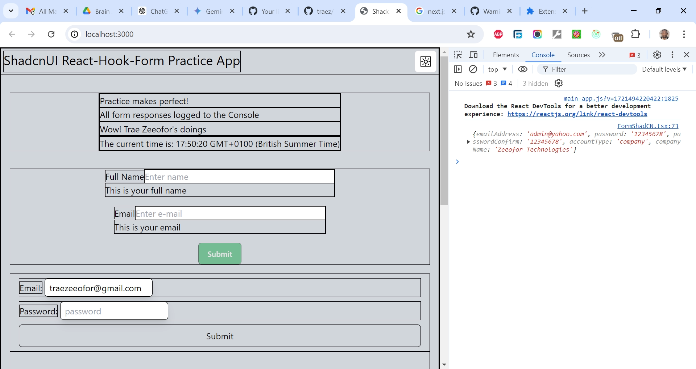

# ShadcnUI react-hook-form Practice App

This is a 3-part combined solution to the [Next.js with shadcn/ui || Architecture || Components || Themes Project](https://www.youtube.com/watch?v=raKAoh9mWzM), [React Hook Form - Complete Tutorial (with Zod) Project](https://www.youtube.com/watch?v=cc_xmawJ8Kg) and [Next JS forms with Shadcn UI (the EASY way) Project](https://www.youtube.com/watch?v=oGq9o2BxlaI). I'm practicing and developing my coding competency by building projects after projects.

## Table of contents

- [Overview](#overview)
  - [The challenge](#the-challenge)
  - [Screenshot](#screenshot)
  - [Links](#links)
  - [My process](#my-process)
  - [Built with](#built-with)
  - [What I learned](#what-i-learned)
  - [Continued development](#continued-development)
  - [Useful resources](#useful-resources)
  - [Author](#author)
  - [Acknowledgments](#acknowledgments)

## Overview

### The Challenge/User Stories

In a typical tutorial video teaching ShadcnUI and React-Hook-Form, the goal would be to guide users through the process of building a dynamic, user-friendly web application form. The tutorial would cover the essentials of setting up ShadcnUI for styling and layout, and integrating React-Hook-Form for efficient form handling, including state management, validation, and submission. By the end of the video, viewers should be able to create aesthetically pleasing and highly functional forms, understand the benefits of combining these technologies, and gain practical skills for developing modern web applications.

### Screenshot

### Links

- Solution URL: [https://github.com/traez/shadcnui-react-hook-form-app](https://github.com/traez/shadcnui-react-hook-form-app)
- Live Site URL: [https://shadcnui-react-hook-form-app-trae-zeeofors-projects.vercel.app/](https://shadcnui-react-hook-form-app-trae-zeeofors-projects.vercel.app/)

## My process

### Built with

- Semantic HTML5 markup
- CSS custom properties
- Flexbox and CSS Grid
- Mobile-first workflow
- [React](https://reactjs.org/) - JS library
- [Next.js](https://nextjs.org/) - React framework
- Tailwind CSS
- Typescript
- Nodejs (with/without Expressjs)
- MongoDB**  
- GraphQL**    
- Redux Toolkit**  
- Auth.js (NextAuth)**   
- Shadcn UI    
- react-hook-form    

### What I learned
   
- **Shadcn UI Approach**      
**No Installation:** Instead of installing a package, you run a command to copy the component code into your project (e.g., `npx shadcn-ui@latest init`).    
**Code Ownership** The components are copied directly into your project's codebase, making them yours to modify without the need for package updates. You customize the code to fit your specific needs.    
**Usage:** After copying the code, you import components from your own project directory (e.g., `import { Input } from "@/components/ui/input"`).  
- **cva() - Class Variance Authority**    
The cva function from the Class Variance Authority library allows developers to define and manage dynamic and conditional class names for components.  
It helps in creating a consistent styling approach by defining variants and default styles based on component properties.  
This makes it easier to handle different states and appearances of a component in a scalable and maintainable way.    
- **cn() - Custom Utility Function**    
The cn function is a custom utility that combines and conditionally applies class names, leveraging the clsx library for conditional logic and the twMerge library for resolving Tailwind CSS class conflicts.  
This function simplifies the process of applying multiple, sometimes conditional, class names to components, ensuring that only the relevant and non-conflicting classes are used.   
- **clsx**    
The clsx library is a utility for constructing className strings conditionally in React components.  
It accepts a variety of inputs, such as strings, objects, and arrays, and filters out falsy values to produce a final string of class names.  
This is particularly useful for managing complex class name logic in a readable and concise manner.   
- **twMerge**    
The twMerge library is used to intelligently merge Tailwind CSS class names, resolving conflicts by prioritizing the latter classes in the merge process.  
This ensures that only the correct and intended styles are applied, even when there are conflicting class names.  
It is often used in conjunction with clsx to handle the merging of Tailwind-specific class names in a clean and efficient way.   
- **React Hook Form**    
React Hook Form is a lightweight library for managing form state and validation in React applications.  
It leverages React's hooks API to provide a seamless and efficient way to handle form inputs, reducing the need for boilerplate code.  
This library enhances performance by minimizing re-renders and making form data management straightforward through its intuitive API, which supports features like validation, error handling, and form submission without the need for external state management solutions.   
- **Zod**    
Zod is a TypeScript-first schema declaration and validation library that ensures type-safe data parsing and validation.  
It enables developers to define schemas for their data models and provides powerful tools for type inference, runtime validation, and error handling.  
Zod's flexibility and integration with TypeScript make it an excellent choice for projects requiring robust data validation, allowing developers to confidently enforce data structures and maintain type safety across their applications.    
- **pattern attribute in HTML input forms**    
The pattern attribute in HTML input forms allows you to specify a regular expression that the user's input must match for the form to be considered valid.  
This helps ensure users enter data in the expected format, like email addresses, phone numbers, or specific date patterns.  
It provides basic validation without relying on JavaScript.    

### Continued development

- More projects; increased competence!

### Useful resources

Stackoverflow  
YouTube  
Google  
ChatGPT

## Author

- Website - [Trae Zeeofor](https://github.com/traez)
- Twitter - [@trae_z](https://twitter.com/trae_z)

## Acknowledgments

-Jehovah that keeps breath in my lungs
